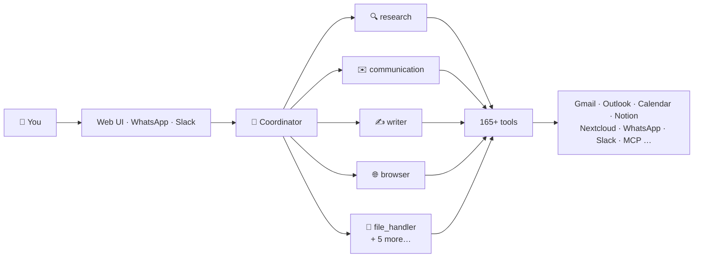

<div align="center">
  

# Open Assistant

### The self-hosted AI assistant that *does* things.

[](https://github.com/open-assistant-org/open-assistant/releases)
[](LICENSE)
[](pyproject.toml)
[](https://github.com/open-assistant-org/open-assistant/stargazers)
[](CONTRIBUTING.md)

</div>

<br />

<div align="center">
  <a href="https://openassistant.s3.eu-central-1.amazonaws.com/blog/gifs/github-demo/open-assistant-chat.gif">
    
  </a>

  <p><i>"What can you do?" — Open Assistant knows, because it's wired into everything.</i></p>
</div>

Most AI chatbots  only talk. Open Assistant runs as a single Docker container and plugs your LLM into your **email, calendar, files, notes, and the web**. Ask it to *find that invoice from March*, *book lunch with Sarah on Thursday*, or *summarize what happened while you were asleep* — and a team of specialist agents gets it done. Your data, your machine, no SaaS middleman.

<div align="center">

```bash
bash <(curl -fsSL https://raw.githubusercontent.com/open-assistant-org/open-assistant/main/install.sh)
```

That's it — the script pulls the image, walks you through your LLM provider, and you're live at `http://localhost:8080`.

[Quick start](#-quick-start) · [See it in action](#-see-it-in-action) · [Integrations](#-integrations) · [Architecture](#-architecture) · [Documentation](https://docs.open-assistant.org) · [Contributing](#-contributing)

</div>

<br />

## ✨ See it in action

### 🤖 A specialist for every job

A **coordinator agent** routes each request to the right specialist — research, communication, writing, file handling, planning, browsing, and more. Not enough? Spin up your own agents with a custom role, goal, and backstory, or connect a **remote MCP server** and its tools become available instantly.

<div align="center">
  
</div>

### 🎛️ Drag-and-drop tool control

Every one of the **165+ tools** can be reassigned with a drag. Give your Notion agent exactly the tools it needs — nothing more, nothing less. Granular, visual, no config files.

<div align="center">
  
</div>

### 🎨 Artifacts that stick around

Ask for a web page, dashboard, or document and the assistant saves it as an **artifact** — a rendered HTML file you can open, revisit, and share any time. It's not just chat history; it's a growing library of things your assistant built for you.

<div align="center">
  
</div>

## 🔋 Highlights

- 🔒 **Private by design** — Single-user, single-container, self-hosted. Credentials are encrypted at rest, and your data never leaves your machine.
- 🧠 **A team, not a chatbot** — 10 built-in agents, 165+ tools, and a coordinator that knows who to call. Create your own agents in the UI.
- 🔓 **No lock-in** — Bring your own brain: OpenRouter, Anthropic, Groq, or run fully offline with [Ollama](docs/integrations/llm-providers.md) / vLLM.
- ⏰ **Works while you sleep** — Recurring cron jobs and one-shot scheduled tasks. A nightly job even maintains your assistant's memory and personality.
- 🧩 **Extensible** — Remote [MCP servers](docs/mcp-servers.md), a plugin system, and custom agents mean the toolset grows with you.
- 💬 **Wherever you are** — Full-featured web UI, plus two-way [WhatsApp](docs/integrations/whatsapp.md) and [Slack](docs/integrations/slack.md) messaging (text, voice notes, and images).

## 🔌 Integrations

| | Category | What it can do |
|---|---|---|
| 📧 | **Gmail · Outlook** | Send, read, search, draft, and label email |
| 📅 | **Google Calendar · Outlook Calendar** | List and create events, attendees, online meetings |
| 📁 | **OneDrive · Nextcloud** | List, search, read, and download files |
| 📝 | **Notion · OneNote** | Create and update pages, query databases, take notes |
| ✅ | **Microsoft To Do** | Manage task lists and tasks |
| 💬 | **WhatsApp · Slack** | Two-way messaging, voice notes, images |
| 🔍 | **Brave Search · Google News** | Privacy-focused web and news search |
| 🗺️ | **Google Navigator** | Places, directions, geocoding |
| 📊 | **Google Ads · Yahoo Finance · Toggl** | Campaign data, quotes and financials, time tracking |
| 🌐 | **Playwright browser** | Navigate, click, type, screenshot, extract — with vision |
| 🎙️ | **Whisper · Mistral OCR** | Transcribe voice messages, read PDFs |
| 🔌 | **MCP servers** | Connect any remote MCP server, authenticated with static headers |

Each integration is enabled independently — connect only what you need, and the tools appear. See the [integration guides](docs/integrations/) for setup.

## 🚀 Quick start

The one-liner above is all most people need. Prefer to see what's happening? Here are the manual paths.

<details>
<summary><b>📦 Run with Docker</b></summary>

<br />

```bash
docker pull ghcr.io/open-assistant-org/open-assistant:latest

docker run -d \
  -p 8080:8080 \
  -v $(pwd)/data:/app/data \
  -v $(pwd)/logs:/app/logs \
  -v $(pwd)/config:/app/config \
  -e ENCRYPTION_KEY="your-key-here" \
  -e APP_URL="http://localhost:8080" \
  --name open-assistant \
  ghcr.io/open-assistant-org/open-assistant:latest

# Check health
curl http://localhost:8080/health
```

Generate an encryption key with:

```bash
python -c "from cryptography.fernet import Fernet; print(Fernet.generate_key().decode())"
```

> **Going to production?** Set `APP_URL` to your domain (e.g. `https://assistant.yourdomain.com`) and add `CORS_ORIGINS` with the same value.

</details>

<details>
<summary><b>🛠️ Build from source with Docker Compose</b></summary>

<br />

```bash
git clone https://github.com/open-assistant-org/open-assistant
cd open-assistant

cp .env.example .env
# Edit .env — at minimum set ENCRYPTION_KEY and APP_URL

docker-compose up -d
docker-compose logs -f
```

</details>

<details>
<summary><b>💻 Local development with uv</b></summary>

<br />

```bash
git clone https://github.com/open-assistant-org/open-assistant
cd open-assistant

# Install uv (if you don't have it)
curl -LsSf https://astral.sh/uv/install.sh | sh

uv sync

cp .env.example .env
# Set ENCRYPTION_KEY in .env (generate one as above)

# Run the app — the database initializes automatically
uv run python -m src.main
```

WhatsApp integration only (optional):

```bash
cd src/integrations/whatsapp/bridge
npm install && npm start
```

</details>

### Connect your tools

Open **Settings** in the web UI and connect services one by one — Google, Microsoft, Notion, Nextcloud, Brave Search, and more. Each connection expands the tools your agents can use. Every OAuth token and API key is encrypted before it touches disk.

### Talk to it

- **Web UI** — chat, conversation history, artifacts, agent management, monitoring dashboard
- **WhatsApp** — scan a QR code in Settings, then just message your assistant
- **Slack** — invite the bot to a channel (Socket Mode works behind firewalls)

## 🧠 Architecture

One container, three layers: a coordinator agent understands your request and delegates to specialist agents, which call the tools exposed by the integrations you've connected.



- **Agents (10 built-in)** — coordinator, research, communication, writer, file_handler, planner, navigator, system, browser, plugin_creator. All editable in the UI; add your own at any time.
- **Tools (165+)** — mapped to service operations, assigned to agents per your drag-and-drop layout.
- **Integrations** — enabled independently. Connect Google and you get Gmail + Calendar tools; add Notion and the writer agent learns new tricks.

### Project structure

```
open-assistant/
├── src/
│   ├── agents/          # Agent definitions & registry
│   ├── api/             # REST API endpoints
│   ├── core/            # Database, tools, scheduler, MCP
│   ├── integrations/    # Gmail, Outlook, Notion, Nextcloud, WhatsApp, Slack, …
│   ├── models/          # Data models
│   ├── services/        # Business logic
│   ├── ui/              # Web UI (vanilla JS — no build step)
│   └── utils/           # Helpers
├── docs/                # Architecture, integration & setup guides
├── tests/               # Test suite
└── docker-compose.yml
```

### Tech stack

**Python 3.11+** · FastAPI · SQLite · Vanilla JS/HTML/CSS frontend · Playwright (Chromium) · APScheduler · single Docker container

## 📚 Documentation

Full docs live at [docs.open-assistant.org](https://docs.open-assistant.org) and in the [`docs/`](docs/) directory:

- [Install & update guide](docs/setup/install-and-update.md)
- [Configuration reference](docs/setup/configuration.md)
- [LLM provider setup](docs/integrations/llm-providers.md) — OpenRouter, Anthropic, Groq, Ollama, vLLM
- [MCP servers](docs/mcp-servers.md)
- [Slash commands](docs/commands.md) — `/clear` and friends
- [Development setup](docs/setup/development.md)

## 🤝 Contributing

Contributions are welcome — bug reports, feature ideas, integrations, and docs all count. Read [CONTRIBUTING.md](CONTRIBUTING.md) for the workflow, and [docs/setup/development.md](docs/setup/development.md) to get a dev environment running. The project follows documentation-first development: features are documented before they're implemented.

## 🔒 Security

- All credentials are stored encrypted (Fernet) — never in plaintext
- OAuth2 for every service integration, with automatic token refresh
- Single-user by design: no multi-tenant surface to attack
- See the [configuration guide](docs/setup/configuration.md) for security best practices

## 📄 License

Distributed under the [BUSL-1.1 License](LICENSE).
