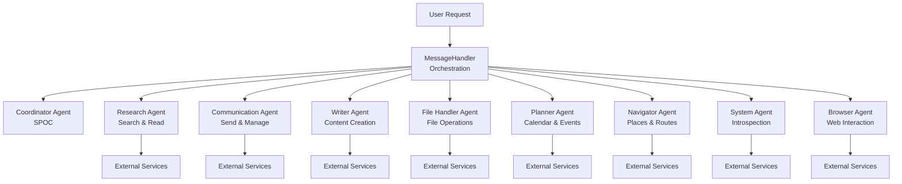
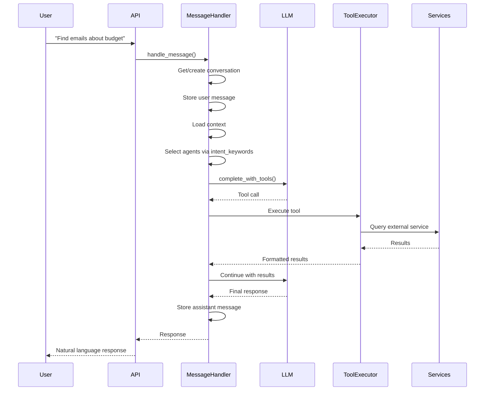
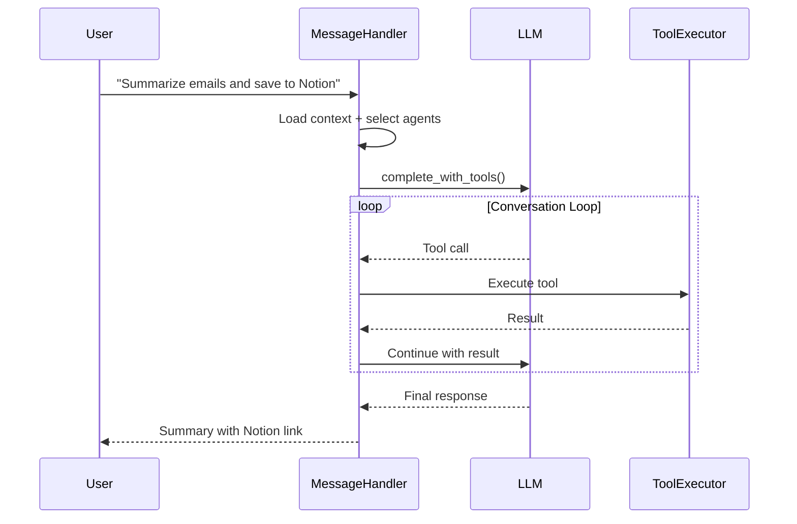

# Agent Architecture

This document describes the multi-agent system that orchestrates task execution across integrated services.

## Overview

Open Assistant uses a **skill-based agent selection** system driven by the `MessageHandler`. Agent definitions are stored in the database. A **Coordinator Agent** serves as the default orchestrator, delegating tasks to specialized agents. The system selects agents based on `intent_keywords` matching against user messages.



## Design Principles

### 1. Tool Ownership (No Overlap)
Each agent owns a distinct set of tools. This ensures:
- Clear responsibility boundaries
- No conflicting tool calls
- Predictable behavior
- Easier debugging

### 2. Coordinator as SPOC
All user requests flow through the Coordinator Agent, which:
- Understands user intent
- Selects appropriate specialist agent(s)
- Coordinates multi-agent workflows
- Synthesizes final responses

### 3. Services Stay Unchanged
Agents sit on top of the existing service layer:
```
Agent Definitions → Tools (ToolRegistry) → ToolExecutor → Services → External APIs
```

### 4. Modular Agent Definitions
Agent configurations (role, goal, backstory, tools, intent_keywords) are stored in the database, allowing:
- Runtime modification via Settings UI
- Easy addition of new agents
- A/B testing of agent prompts
- Tool reassignment between agents

---

## Agent Definitions

### Coordinator Agent

**Role**: Task Coordinator

**Goal**: Understand user intent, create an actionable plan, and delegate to specialist agents.

**Behavior**:
- Analyzes incoming user messages
- Delegates to specialist agents by role name
- Creates execution plans for multi-step tasks
- Handles scheduling and calculations directly

---

### Research Agent

**Role**: Research Specialist

**Goal**: Find and retrieve information from emails, files, notes, and web sources.

**Behavior**:
- Searches across integrated data sources (email, files, notes, web)
- Uses keyword and semantic search capabilities
- Retrieves full content from found items
- Handles attachments and file content extraction

---

### Communication Agent

**Role**: Communication Specialist

**Goal**: Compose and send messages, manage emails, and handle email classification.

**Behavior**:
- Drafts and sends emails through integrated providers
- Manages email threads and drafts
- Handles message classification and labeling
- Supports multiple messaging channels (email, WhatsApp, etc.)

---

### Writer Agent

**Role**: Content Writer

**Goal**: Create, edit, and manage written content on integrated platforms.

**Behavior**:
- Generates long-form content using AI assistance
- Creates and updates pages/notes on platforms like Notion
- Generates documents in various formats
- Edits and refines existing content

---

### File Handler Agent

**Role**: File Management Specialist

**Goal**: Manage files across cloud storage platforms.

**Behavior**:
- Lists and searches files across multiple storage backends
- Uploads, downloads, and organizes files
- Moves, copies, and deletes files
- Creates folders and manages directory structures

---

### Planner Agent

**Role**: Planning Specialist

**Goal**: Manage calendars, schedule events, and help with time-based planning.

**Behavior**:
- Creates, reads, updates, and deletes calendar events
- Queries calendars across multiple providers
- Handles scheduling with time zone awareness
- Supports task and reminder management

---

### Navigator Agent

**Role**: Geographic & Route Planning Specialist

**Goal**: Find places, plan routes, and answer location-based questions.

**Behavior**:
- Searches for places and businesses
- Retrieves directions and travel times
- Geocodes addresses and coordinates
- Finds nearby locations of various types

---

### System Agent

**Role**: System Introspection & Self-Improvement Specialist

**Goal**: Maintain and improve the assistant's self-knowledge.

**Behavior**:
- Inspects application logs for diagnostics
- Reviews conversation history for context
- Updates memory and personality prompts
- Extracts and stores facts about the user

---

### Browser Agent

**Role**: Interactive Web Browsing Specialist

**Goal**: Navigate and interact with web pages.

**Behavior**:
- Navigates to URLs and extracts page content
- Interacts with page elements (click, type, scroll)
- Handles forms and multi-step web workflows
- Extracts structured data from web pages

---

## Architecture

### Directory Structure

```
src/
├── agents/
│   ├── base.py              # AgentDefinition dataclass + defaults
│   └── registry.py          # AgentRegistry
├── api/
│   └── agents.py            # Agent management API endpoints
```

### Database Schema

```sql
CREATE TABLE agent_definitions (
    id INTEGER PRIMARY KEY AUTOINCREMENT,
    name TEXT UNIQUE NOT NULL,
    display_name TEXT NOT NULL,
    role TEXT NOT NULL,
    goal TEXT NOT NULL,
    backstory TEXT NOT NULL,
    tools JSON NOT NULL DEFAULT '[]',
    priority INTEGER DEFAULT 5,
    intent_keywords JSON DEFAULT '[]',
    enabled BOOLEAN DEFAULT TRUE,
    allow_delegation BOOLEAN DEFAULT FALSE,
    created_at TIMESTAMP DEFAULT CURRENT_TIMESTAMP,
    updated_at TIMESTAMP DEFAULT CURRENT_TIMESTAMP
);
```

### Agent Registry

The registry manages agent lifecycle:
- `get_all_agents()` - Retrieve all agent definitions
- `get_enabled_agents()` - Get only active agents
- `update_agent()` - Modify agent configuration
- `toggle_agent()` - Enable/disable agents
- `assign_tool_to_agent()` - Reassign tools between agents
- `seed_default_agents()` - Initialize default agents on first run

---

## Request Flow

### Simple Request



### Complex Request (Multi-Step)



---

## Settings UI: Agents Tab

The Settings page includes an **Agents** tab where you can:
- View all agents with their roles
- Enable or disable agents
- See which tools are assigned to each agent
- Edit agent backstory/prompts
- Reassign tools between agents

---

## Agent Selection

The `MessageHandler` selects agents based on `intent_keywords` matching against the user's message. Selected agents' tools are made available to the LLM for the conversation turn. Higher priority agents are considered first.

---

## Related Documentation

- [Software Architecture](software-architecture.md) - Overall system design
- [Database Schema](database-schema.md) - Data model
