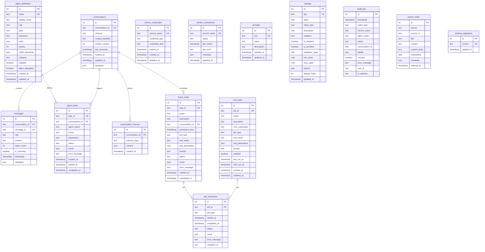
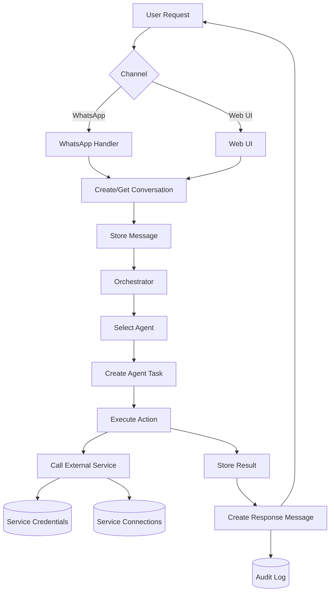
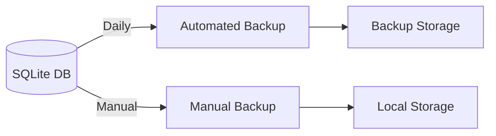

# Database Schema

Open Assistant uses SQLite (or PostgreSQL in production) to persist conversations, task history, credentials, and system state.

## Entity Relationship Diagram



## Schema Overview

### Core Tables

#### 1. Conversations
Stores conversation sessions across all communication channels.

**Purpose**: Track conversation context and history per channel
**Key Fields**:
- `conversation_id`: Unique identifier for the conversation
- `channel`: Communication channel (whatsapp, webui)
- `contact_identifier`: Phone number or session ID
- `context_version`: Context management version
- `last_accessed`: Last activity timestamp

**Relationships**:
- One-to-many with `messages`
- One-to-many with `agent_tasks`
- One-to-many with `conversation_memory`

#### 2. Messages
Individual messages within conversations.

**Purpose**: Store complete conversation history with role-based messages
**Key Fields**:
- `role`: Message source (user, assistant, system)
- `content`: Message text
- `token_count`: Number of tokens in the message
- `is_summary`: Whether this message is a generated summary
- `metadata`: Attachments, agent info, etc.

**Relationships**:
- Many-to-one with `conversations`

#### 3. Agent Definitions
Stores CrewAI agent configurations.

**Purpose**: Define agents with their roles, goals, and tool assignments
**Key Fields**:
- `name`: Unique agent identifier (coordinator, research, communication, writer, file_handler, planner, navigator, system, browser)
- `role`: Agent role description
- `goal`: What the agent aims to achieve
- `backstory`: System prompt / detailed instructions
- `tools`: JSON array of assigned tool names
- `priority`: Selection priority (1-10, higher = selected first)
- `intent_keywords`: JSON array of keywords for skill matching
- `category`: Agent category
- `allow_delegation`: Whether agent can delegate to others

**Relationships**:
- One-to-many with `agent_tasks`

**Default Agents**:
- `system` - System introspection and memory management
- `navigator` - Geographic & route planning
- `file_handler` - File management across Nextcloud/OneDrive
- `writer` - Content writing
- `browser` - Interactive web browsing
- `planner` - Calendar and scheduling
- `communication` - Email and messaging
- `research` - Information retrieval and search
- `coordinator` - Task coordination and delegation

See [Agent Architecture](agents.md) for detailed agent definitions.

#### 4. Agent Tasks
Tracks tasks executed by specialized agents.

**Purpose**: Monitor agent execution, results, and errors
**Key Fields**:
- `agent_name`: Which agent handled the task
- `action`: What action was performed
- `status`: pending, running, completed, failed
- `result`: Task output data

**Relationships**:
- Many-to-one with `conversations` (nullable)
- Many-to-one with `agent_definitions`

### Scheduling Tables

#### 5. Cron Jobs
Scheduled recurring tasks with Docker-isolated execution.

**Purpose**: Define and manage scheduled tasks (tool calls or prompts)
**Key Fields**:
- `cron_expression`: Cron schedule (e.g., "0 9 * * MON")
- `job_type`: 'tool' for direct execution, 'prompt' for agent processing
- `tool_name`: Tool to execute (if job_type='tool')
- `tool_parameters`: JSON parameters for tool
- `prompt`: Prompt to send to coordinator (if job_type='prompt')
- `enabled`: Active/inactive status
- `next_run_at`: Calculated next execution time

**Relationships**:
- One-to-many with `job_executions`

#### 6. Future Tasks
One-time scheduled tasks.

**Purpose**: Schedule tasks to execute once at a specific time
**Key Fields**:
- `name`: Human-readable task name
- `description`: Task description
- `conversation_id`: Associated conversation (nullable)
- `scheduled_time`: When to execute
- `job_type`: 'tool' or 'prompt'
- `status`: pending, completed, failed, cancelled
- Same tool_name/tool_parameters/prompt fields as cron_jobs

**Relationships**:
- Many-to-one with `conversations` (nullable)
- One-to-many with `job_executions`

#### 7. Job Executions
Unified execution history for both cron jobs and future tasks.

**Purpose**: Track execution history for monitoring and debugging
**Key Fields**:
- `job_id`: References cron_jobs.job_id or future_tasks.task_id
- `job_type`: 'cron' or 'future_task'
- `status`: running, success, failed
- `container_id`: Docker container ID (for isolated execution)
- `result`: Execution output
- `error_message`: Failure details

**Relationships**:
- Many-to-one with `cron_jobs`

### Service Integration Tables

#### 8. Service Credentials
Encrypted storage for OAuth tokens and API keys.

**Purpose**: Securely store authentication credentials
**Key Fields**:
- `service_name`: gmail, outlook, notion, etc.
- `credential_type`: oauth_token, api_key, app_password
- `credential_data`: Encrypted JSON blob
- `expires_at`: Token expiration timestamp

**Security**: All `credential_data` is encrypted using Fernet symmetric encryption

#### 9. Service Connections
Track connection status of integrated services.

**Purpose**: Monitor service health and connectivity
**Key Fields**:
- `service_name`: Service identifier (unique)
- `status`: connected, disconnected, error
- `last_check`: Last health check timestamp
- `last_error`: Most recent error message
- `metadata`: Service-specific info (email, username)

### Personalization Tables

#### 10. Prompts
Stores assistant personalization configuration: system prompt, memory, and soul.

**Purpose**: Enable users to customize the assistant's behavior, knowledge, and personality
**Key Fields**:
- `key`: Prompt identifier (`system_prompt_default`, `system_prompt_custom`, `memory`, `soul`)
- `value`: Prompt text content
- `description`: Explanation of the prompt's purpose

**Default Entries**:
- `system_prompt_default`: Base system prompt defining core assistant behavior
- `system_prompt_custom`: User-defined custom instructions added on top of the default
- `memory`: Text-based store for user context (name, preferences, people, places, relations)
- `soul`: Personality and communication style description, shaped by user feedback

### System Tables

#### 11. Settings
Application-wide configuration and user preferences.

**Purpose**: Store dynamic configuration values
**Key Fields**:
- `key`: Setting identifier
- `value`: Setting value (stored as string)
- `value_type`: Type hint for parsing (string, int, bool, json)
- `category`: Setting category (default: 'application')
- `is_required`: Whether the setting is required
- `is_sensitive`: Whether the value is sensitive (e.g., API keys)
- `validation_regex`: Optional regex for value validation
- `min_value`/`max_value`: Numeric validation bounds
- `options`: JSON array of valid values (for enum-like settings)
- `display_order`: UI ordering hint

#### 12. Audit Log
Complete audit trail of system operations.

**Purpose**: Security auditing and debugging
**Key Fields**:
- `event_type`: Type of event (api_call, agent_action, etc.)
- `success`: Operation outcome
- `details`: Event-specific data
- `user_id`: Associated user identifier
- `ip_address`: Client IP address

#### 13. Conversation Memory

Stores conversation context and memory for each conversation.

**Purpose**: Enable context-aware responses with short-term and long-term memory
**Key Fields**:
- `memory_type`: Type of memory (short_term, long_term, facts, working)
- `content`: JSON containing memory data
- `created_at`: When memory was stored

**Relationships**:
- Many-to-one with `conversations`

**Memory Types**:
- `short_term`: Recent messages (last 10-20)
- `long_term`: Conversation summaries
- `facts`: Extracted facts (names, preferences, dates)
- `working`: Current task context

#### 14. Search Index

Stores searchable content with embeddings for semantic search.

**Purpose**: Enable semantic search across indexed content
**Key Fields**:
- `source`: Source system (e.g., 'memory', 'file', 'email')
- `source_id`: Unique ID within the source system
- `title`: Content title
- `content`: Full text content
- `content_hash`: Hash for deduplication
- `embedding`: Vector embedding (BLOB)
- `metadata`: Additional source-specific data
- `indexed_at`: When content was indexed

**Constraints**: Unique on (source, source_id)

#### 15. Schema Migrations

Tracks applied database migrations.

**Purpose**: Prevent re-running migrations on startup
**Key Fields**:
- `version`: Migration version identifier (unique)
- `applied_at`: When the migration was applied

## Data Flow Diagram



## Indexing Strategy

### High-Traffic Queries
- `messages.conversation_id` - Frequently queried for conversation history
- `agent_tasks.status` - Task monitoring queries
- `conversations.updated_at` - Recent conversations listing
- `audit_log.timestamp` - Time-based audit queries

### Optimization
- Composite indexes on frequently filtered combinations
- Foreign key indexes for join performance
- Timestamp indexes for time-range queries

## Data Retention Policies

| Table | Retention Policy |
|-------|------------------|
| conversations | Indefinite (user-managed) |
| messages | Indefinite (user-managed) |
| agent_tasks | Last 1000 per conversation |
| cron_job_executions | Last 100 per job |
| audit_log | 30 days |
| service_credentials | Until revoked |
| service_connections | Until disconnected |
| prompts | Indefinite (user-managed) |
| settings | Indefinite |
| conversation_memory | Short-term: 20 msgs, Long-term: indefinite |
| future_tasks | 90 days after execution |

## Encryption

### Encrypted Fields
- `service_credentials.credential_data` - Fernet symmetric encryption

### Encryption Key Management
- Key stored in environment variable: `ENCRYPTION_KEY`
- Generated using: `Fernet.generate_key()`
- Never committed to version control

## Backup Strategy



**Automated Backups**:
- Frequency: Daily at 3 AM
- Retention: Last 7 daily, 4 weekly, 3 monthly
- Location: `data/backups/`

**Manual Backups**:
```bash
python -m src.core.database backup
```

## Database Files

- **`data/assistant.db`** - Main application database
- **`data/jobs.db`** - APScheduler job store (managed by APScheduler)
- **`data/backups/`** - Database backups directory

## Migration Management

Migrations are located in `src/core/migrations/` and applied automatically on startup.

**Migration Format**: `{version}_{description}.sql`

Example: `043_oss_db_init.sql`

**Applying Migrations**:
```bash
python -m src.core.database init
```

**Migration Tracking**: `schema_migrations` table tracks applied migrations

## Performance Considerations

### SQLite Limitations
- Single writer at a time
- Not suitable for high-concurrency writes
- Consider PostgreSQL for production

### Optimization Tips
- Use connection pooling
- Enable WAL mode for better concurrency
- Regular VACUUM operations
- Monitor database size

### Migration to PostgreSQL

The schema is designed to be compatible with PostgreSQL. Migration path:
1. Export data from SQLite
2. Update `DATABASE_URL` to PostgreSQL connection string
3. Run migrations on PostgreSQL
4. Import data

## Schema Versioning

Schema changes are tracked through:
- Migration files in `src/core/migrations/`
- `schema_migrations` table entries
- Documentation updates in this file

## Related Documentation

- [Database Implementation](https://github.com/open-assistant-org/open-assistant/blob/main/src/core/database.py) - Python implementation
- [Migration Files](https://github.com/open-assistant-org/open-assistant/blob/main/src/core/migrations/) - SQL migration scripts