# Software Architecture

This document describes the internal software design, components, and their interactions within the Open Assistant application.

## Component Overview

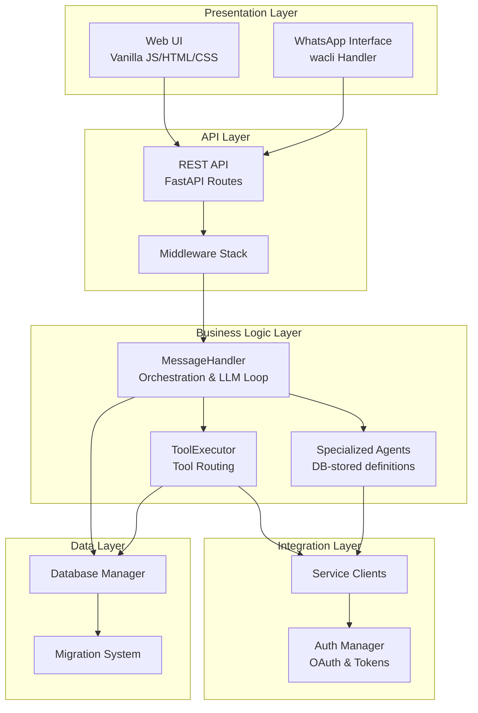

## Layered Architecture

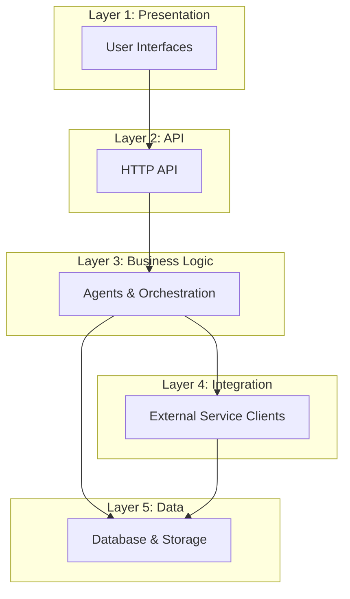

## Core Components

### MessageHandler (Core Orchestration)

The central orchestrator that manages all LLM interactions and tool execution.

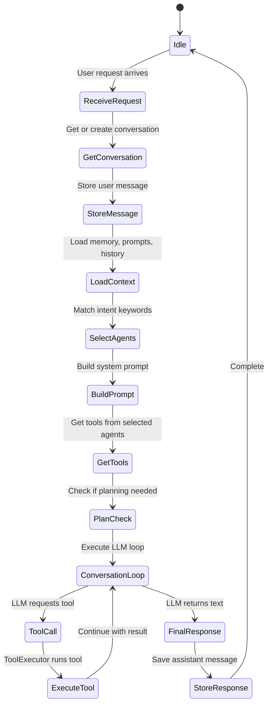

**Responsibilities**:
- Conversation context management
- Agent selection via intent matching
- System prompt construction
- LLM conversation loop execution with tool calling
- Stuck detection and recovery
- Multimodal support (image handling)

### Agent Definitions & Tool Execution

Agents are data-driven configurations stored in the database. Each agent has:
- **Role**: A one-line description of its specialty
- **Goal**: What it aims to achieve
- **Backstory**: Detailed system prompt/instructions
- **Tools**: List of tools it can use
- **Intent Keywords**: Words that trigger this agent
- **Priority**: Higher priority agents are selected first

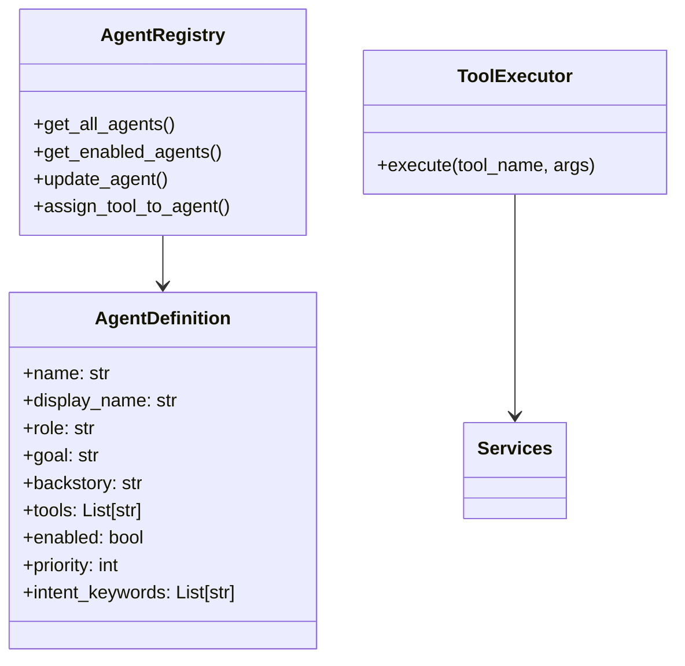

#### Tool Execution Flow

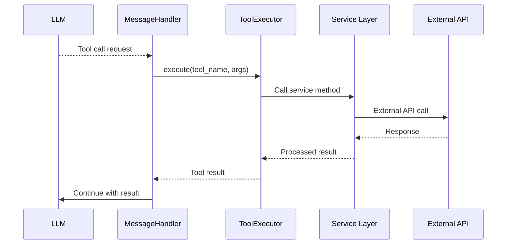

### Service Integration Layer

#### Authentication Manager

The auth manager handles credential storage, token refresh, and encryption:

- Credentials are encrypted at rest using Fernet encryption
- OAuth tokens are automatically refreshed when expired
- Token caching reduces API calls to auth providers
- Each service has its own authentication strategy (OAuth2, API keys, etc.)

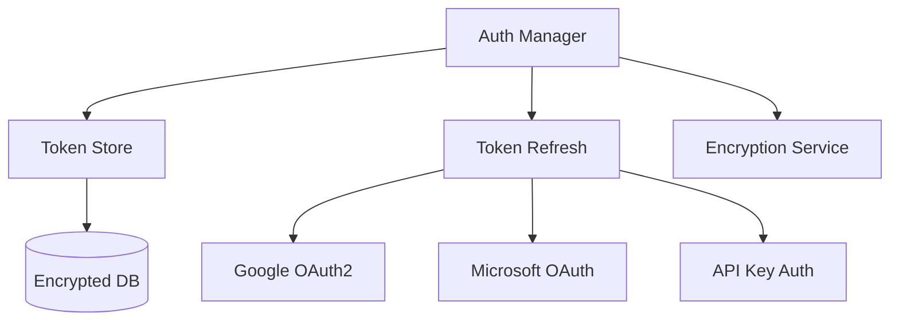

#### Service Client Pattern

Each external service (email, calendar, files, etc.) has a dedicated client:

1. Client requests credentials from Auth Manager
2. Client checks if token is expired and refreshes if needed
3. Client makes API request with current credentials
4. Client handles errors (rate limits, auth failures) with retry logic

### Data Access Layer

#### Database Manager

The database layer uses raw SQLite with a repository pattern:

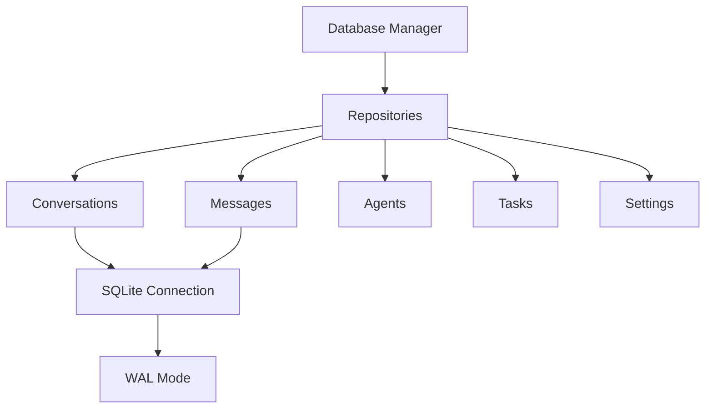

**Key characteristics**:
- WAL mode for better concurrency
- Repository pattern for clean data access
- Automatic migrations on startup
- Encrypted credential storage

### API Layer

The REST API is built with FastAPI and organized into route modules:

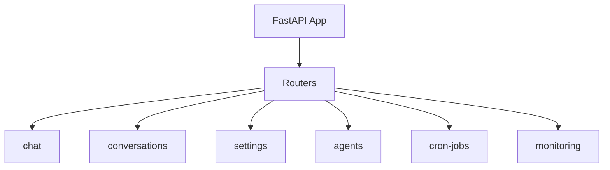

**Middleware includes**:
- CORS handling
- Request logging
- Error handling

## Request Flow Patterns

### Simple Request Flow

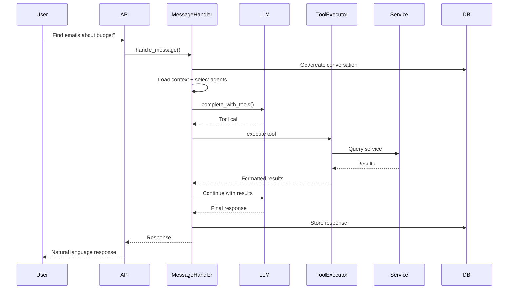

### Complex Multi-Step Flow

For complex requests, the LLM loop executes iteratively:

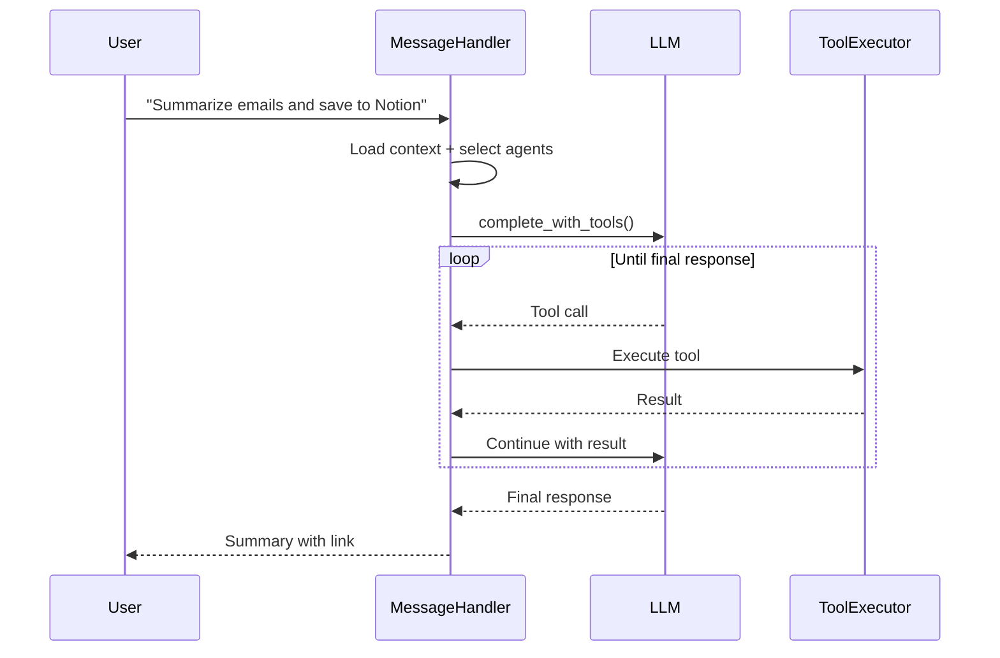

### Error Handling Flow

Tool execution errors are caught and returned as structured failure results. Error recovery varies by component:

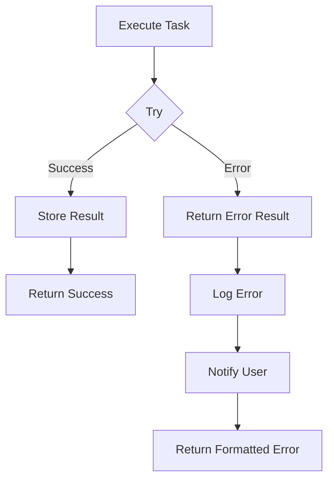

**Per-component behavior**:
- **Brave Search**: Retries once on HTTP 429 (rate limit) with `Retry-After` backoff, capped at 10s
- **Groq LLM**: Retries once on `tool_use_failed` with a format nudge
- **All other tools**: Errors are caught, logged, and returned as failure results without retry

No structured error classification (Transient/Auth/RateLimit/Permanent) or exponential backoff retry system is implemented at the tool layer.

## Task Scheduling

### Cron Job Lifecycle

Jobs go through a lifecycle of scheduling, execution, and tracking:

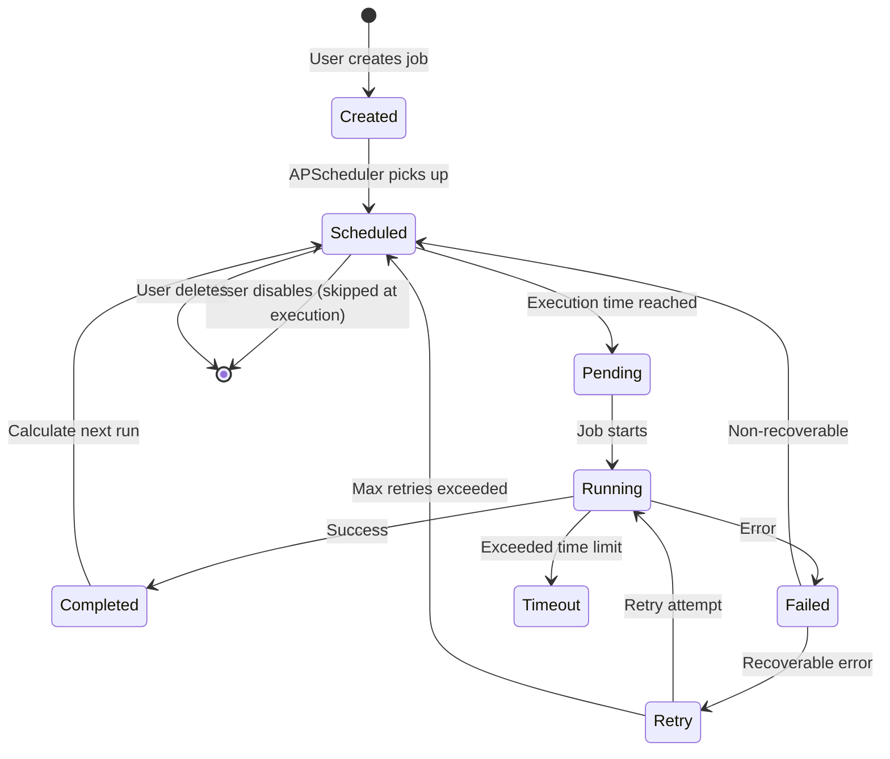

### Job Execution

Scheduled jobs execute through the APScheduler integration:

1. Scheduler triggers job at scheduled time
2. System creates execution record
3. Job action is performed via agent tool execution
4. Result or error is recorded
5. Job state is updated (last run, next run)

## Configuration Management

Configuration follows a priority chain:

```
Database Settings > Environment Variables > Code Defaults
```

**Key aspects**:
- Bootstrap settings (database URL, encryption key) must come from environment variables — they cannot be stored in the database
- Most settings can be managed via the Settings UI
- Credentials are encrypted at rest
- Settings changes take effect immediately (no restart needed for most)
- `.env` file values are loaded as environment variables — they are not a separate config layer

## Observability

### Logging

All application components log through a centralized logger:

- **API Layer**: Request/response logging
- **Business Logic**: Decision and routing logs
- **Agents**: Operation and result logs
- **Services**: API call and response logs
- **Database**: Error logging only

Logs are written to files with daily rotation.

### Monitoring

The monitoring system tracks:
- System health (API, database, external services)
- Job execution history
- Conversation metrics
- Service connection status

## Design Patterns

### Key Patterns

1. **Repository Pattern**: Clean data access abstraction
2. **Registry Pattern**: Centralized management of agent and tool definitions
3. **Strategy Pattern**: Different authentication approaches per service
4. **Dependency Injection**: FastAPI dependencies for testability
5. **Data-Driven Configuration**: Agents stored in database, not code

### SOLID Principles

- **Single Responsibility**: Each service handles one integration domain
- **Open/Closed**: Easy to add new agents/tools
- **Interface Segregation**: Small, focused tool definitions
- **Dependency Inversion**: Services depend on abstractions

## Extension Points

### Adding a New Service Integration

1. Create service client in `src/integrations/<service>/`
2. Implement authentication (OAuth, API key, etc.)
3. Add service methods for each operation
4. Register tools in `src/core/tools/definitions.py`
5. Add tool routing in `src/core/tools/executor.py`
6. Add settings and configuration
7. Update Settings UI if needed

### Adding a New Agent

1. Add agent definition to database seed
2. Assign relevant tools to the agent
3. Configure intent keywords for selection
4. Agent becomes available immediately (no code change needed)
