# Solution Architecture

This document describes the technology stack, frameworks, and tools used to build Open Assistant.

## Technology Stack Overview

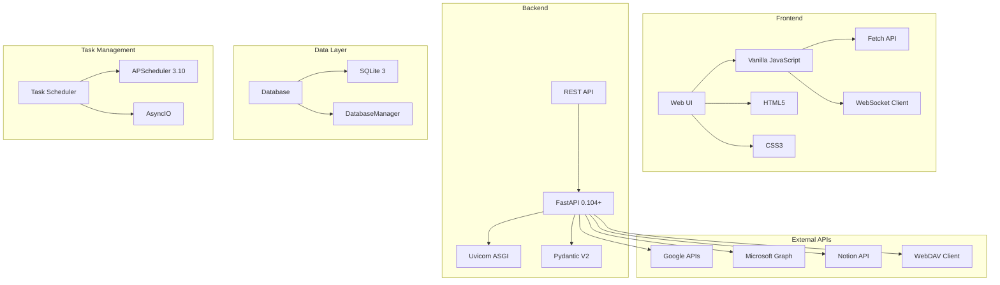

## Backend Framework

### FastAPI - Core Web Framework

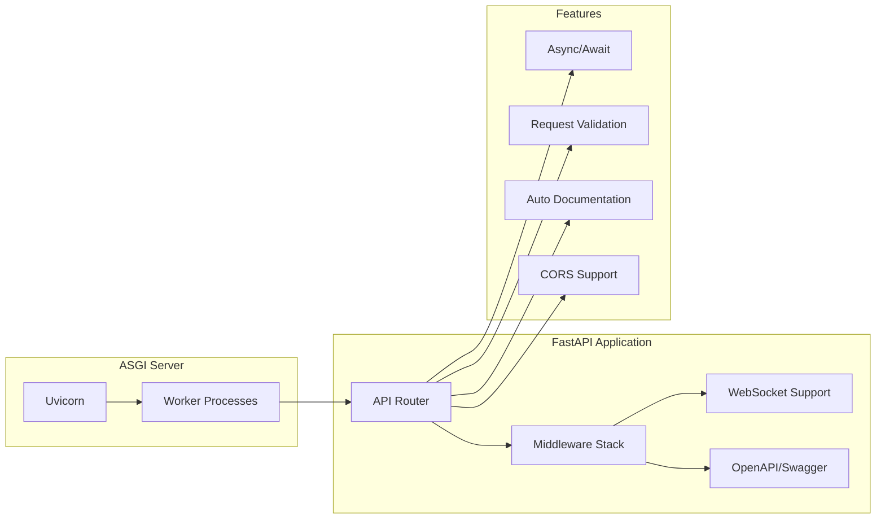

## Frontend Framework

### Vanilla JavaScript - UI Framework

**Deployment Model**: Static HTML, CSS, and JavaScript files served directly by FastAPI via `StaticFiles` middleware. No build process required.

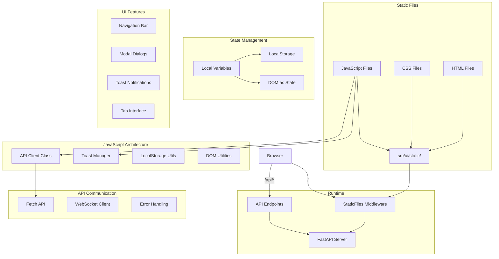

**Key Files**:
```
src/ui/static/
├── index.html          # Chat UI
├── settings.html       # Settings page
├── monitoring.html     # Monitoring dashboard
├── css/
│   ├── common.css      # Shared styles
│   ├── chat.css        # Chat-specific styles
│   └── settings.css    # Settings styles
└── js/
    ├── common.js       # Shared utilities (API client, toast, etc.)
    ├── chat.js         # Chat functionality
    └── settings.js     # Settings management
```


## Database

### SQLite - Development & Single-User

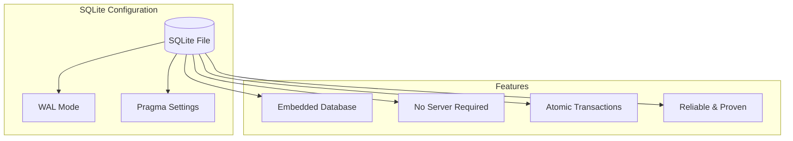

**Why SQLite**:
- Zero configuration
- Single file database
- Perfect for single-user deployments
- No separate database server needed
- Reliable and battle-tested
- Supports full SQL

**Configuration**:
```python
# SQLite with WAL mode
DATABASE_URL = "sqlite:///data/assistant.db"

# Pragma settings
PRAGMA journal_mode=WAL
PRAGMA synchronous=NORMAL
PRAGMA temp_store=MEMORY
PRAGMA mmap_size=30000000000
```


## Database Access - Raw SQLite3 via DatabaseManager

The application uses raw `sqlite3` via `DatabaseManager` — no ORM layer.

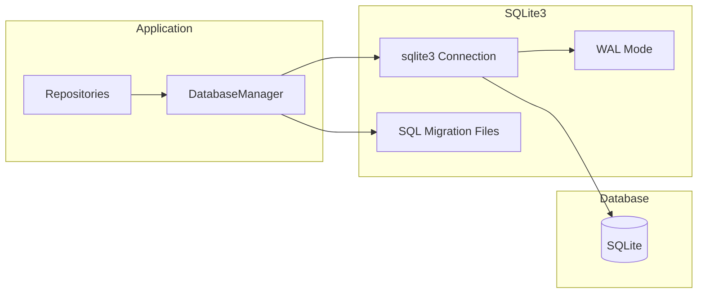

## Task Scheduling - APScheduler

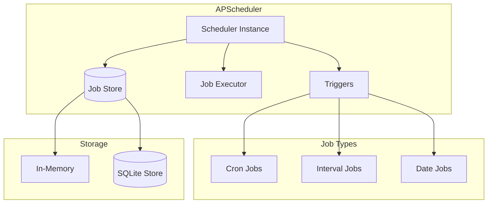

**Configuration**:
```python
from apscheduler.schedulers.asyncio import AsyncIOScheduler
from apscheduler.jobstores.sqlalchemy import SQLAlchemyJobStore

jobstores = {
    'default': SQLAlchemyJobStore(url='sqlite:///data/jobs.db')
}

scheduler = AsyncIOScheduler(jobstores=jobstores)
```

## External API Integrations

### Google APIs (Gmail, Calendar)

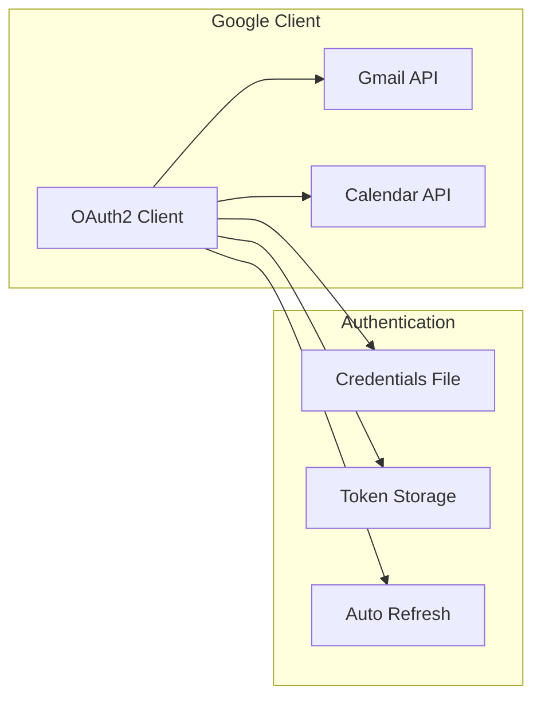

**Library**: `google-api-python-client`

**Dependencies**:
```python
google-api-python-client==2.108.0
google-auth-httplib2==0.1.1
google-auth-oauthlib==1.1.0
```

### Microsoft Graph API (Outlook, OneDrive, Calendar)

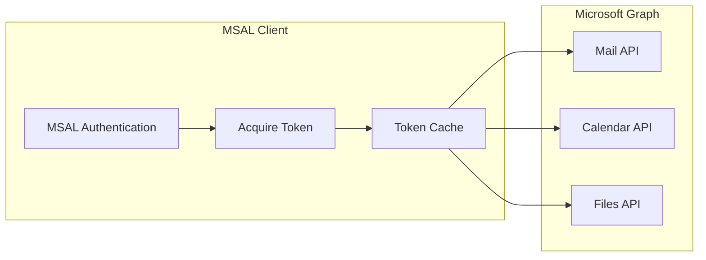

**Library**: `msal` (Microsoft Authentication Library)

**Dependencies**:
```python
msal==1.25.0
requests==2.31.0
```

### Notion API

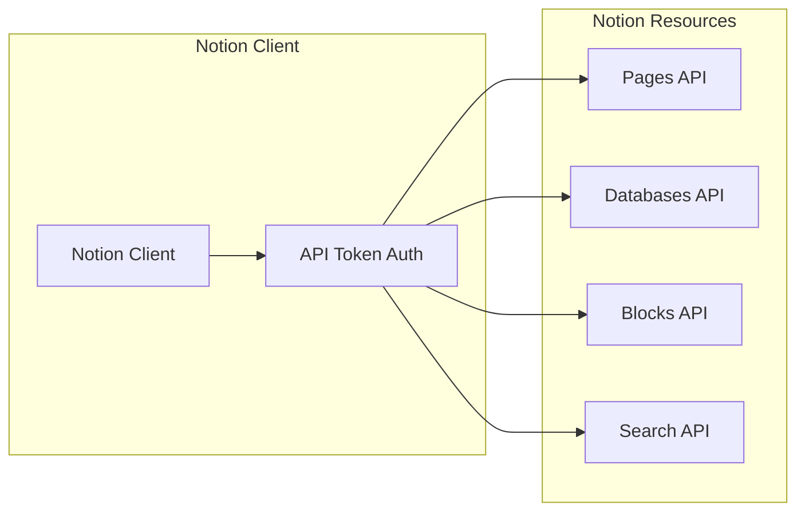

**Library**: `notion-client`

**Dependencies**:
```python
notion-client==2.2.1
```

### Nextcloud (WebDAV)

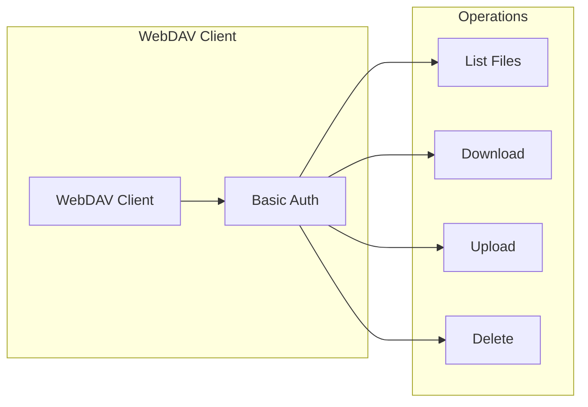

**Library**: `webdavclient3`

**Dependencies**:
```python
webdavclient3==3.14.6
```

## Security & Encryption

### Cryptography - Fernet Encryption

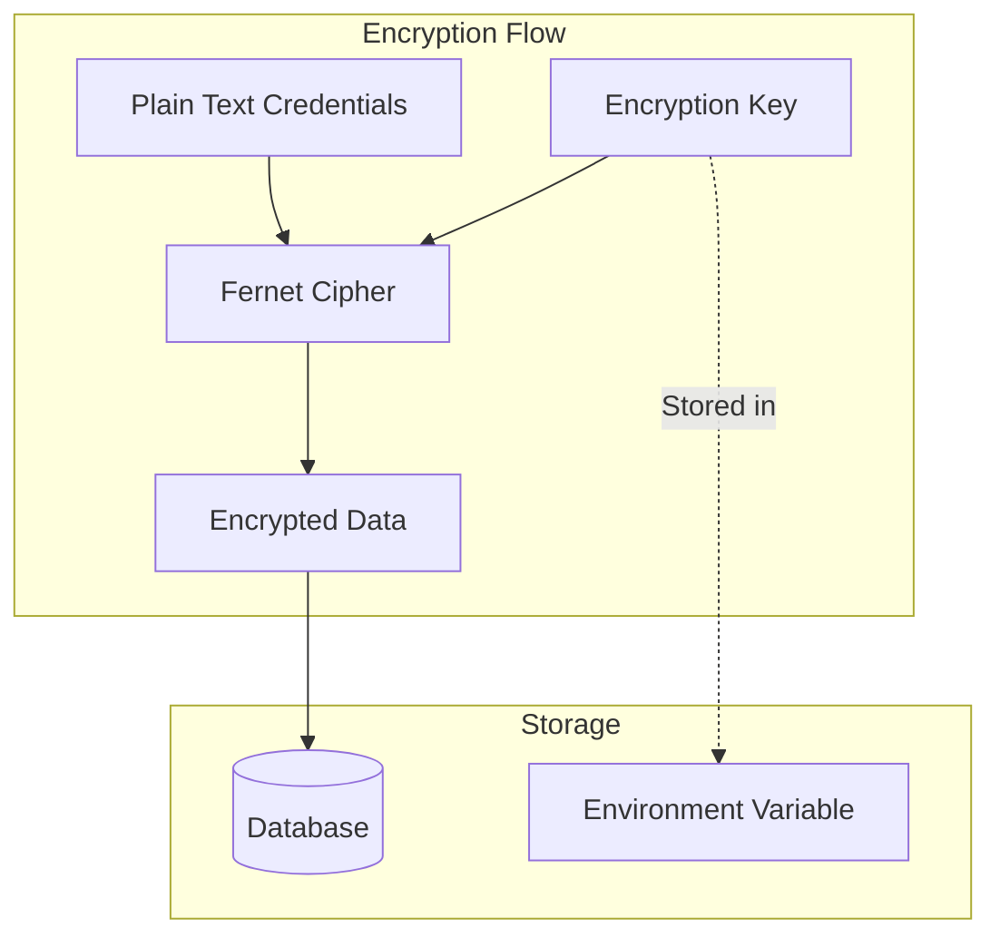

**Library**: `cryptography`

**Dependencies**:
```python
cryptography>=42.0.0
```

**Usage**:
```python
from cryptography.fernet import Fernet

# Generate key (once)
key = Fernet.generate_key()

# Encrypt
cipher = Fernet(key)
encrypted = cipher.encrypt(b"sensitive data")

# Decrypt
decrypted = cipher.decrypt(encrypted)
```

## Configuration Management

### PyYAML + Pydantic

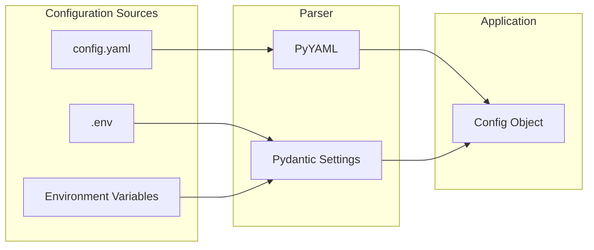

**Libraries**:
- `pyyaml` - YAML parsing
- `pydantic` - Configuration validation
- `python-dotenv` - Environment file loading

**Dependencies**:
```python
pyyaml==6.0.1
python-dotenv==1.0.0
pydantic-settings==2.1.0
```

## Communication Protocols

### HTTP/REST

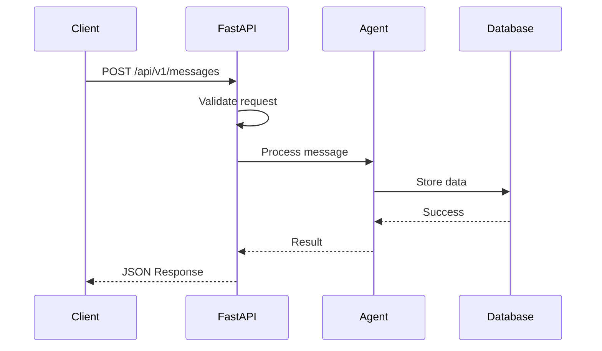

**Features**:
- RESTful endpoints
- JSON request/response
- HTTP status codes
- Request validation
- Auto-generated OpenAPI docs

### WebSocket

WebSocket support is used by the Slack integration (Slack Socket Mode), not as a general FastAPI feature. The main API uses polling or server-sent events for real-time updates.

**Library**: Built into FastAPI

**Usage**:
```python
from fastapi import WebSocket

@app.websocket("/ws")
async def websocket_endpoint(websocket: WebSocket):
    await websocket.accept()
    while True:
        data = await websocket.receive_json()
        await websocket.send_json({"type": "update", "data": data})
```

## Logging

### Structured Logging

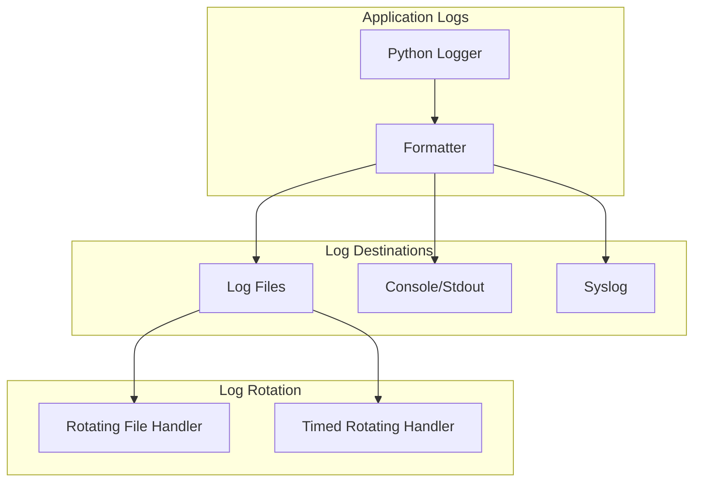

**Python Logging Configuration**:
```python
import logging
from logging.handlers import TimedRotatingFileHandler

logging.basicConfig(
    level=logging.INFO,
    format='%(asctime)s - %(name)s - %(levelname)s - %(message)s',
    handlers=[
        TimedRotatingFileHandler(
            'logs/app.log',
            when='midnight',
            interval=1,
            backupCount=30  # Keep 30 days
        ),
        logging.StreamHandler()
    ]
)
```

## Development Tools

### Code Quality

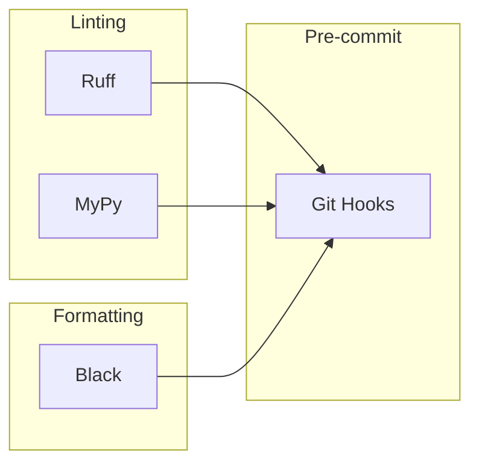

**Web Capabilities**:
```python
# Web browsing and search
playwright==1.40.0    # Browser automation (Apache 2.0 - Free)
brave-search==1.0.0   # Web search API (optional, has free tier)
# or duckduckgo-search==3.9.0  # Alternative web search
```

**Development Dependencies**:
```python
# Development tools
ruff==0.1.6           # Fast Python linter
black==23.11.0        # Code formatter
mypy==1.7.1           # Type checker
pre-commit==3.5.0     # Git hooks framework
```

## Build and Deployment

### Docker

```mermaid
graph TB
    subgraph "Build Process"
        Dockerfile[Dockerfile]
        BaseImage[Python 3.11-slim]
        Dependencies[Install Dependencies]
        AppCode[Copy Application]
        Build[Docker Build]
    end

    subgraph "Image"
        Image[open-assistant:latest]
    end

    subgraph "Registry"
        Local[Local Registry]
        Remote[Docker Hub / GHCR]
    end

    Dockerfile --> BaseImage
    BaseImage --> Dependencies
    Dependencies --> AppCode
    AppCode --> Build
    Build --> Image

    Image --> Local
    Image --> Remote
```
