# System Architecture

This document describes how Open Assistant is deployed and runs as a containerized application for isolated, secure deployments.

## Deployment Overview

Open Assistant runs as a **single containerized application** with all components bundled together for simplified deployment and management.

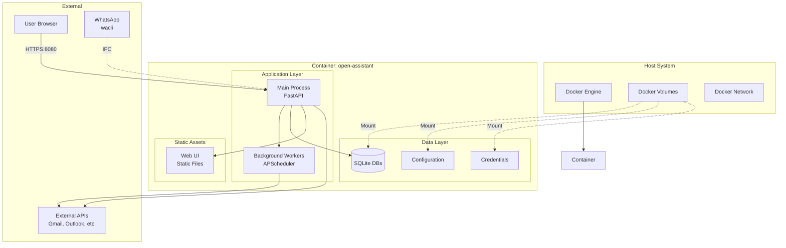

## Container Architecture

### Single Container Design

The application runs in a **single Docker container** containing:
- FastAPI web application (REST API + WebSocket)
- Background task scheduler (APScheduler)
- Web UI static files
- All Python dependencies
- SQLite databases (via mounted volumes)

**Benefits**:
- Simplified deployment (single image)
- Isolated from host system
- Easy updates and rollbacks
- Consistent environment
- Resource control and limits

### Container Components

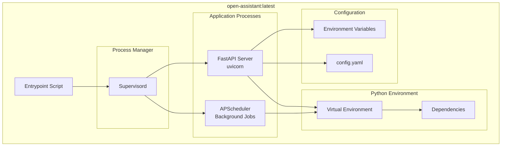

## Volume Mounts

```mermaid
graph LR
    subgraph "Host System"
        HostData[/opt/open-assistant/data]
        HostConfig[/opt/open-assistant/config]
        HostLogs[/opt/open-assistant/logs]
    end

    subgraph "Container"
        ContData[/app/data]
        ContConfig[/app/config]
        ContLogs[/app/logs]
    end

    HostData -.Bind Mount.-> ContData
    HostConfig -.Bind Mount.-> ContConfig
    HostLogs -.Bind Mount.-> ContLogs

    ContData --> DB[(SQLite DBs)]
    ContConfig --> Creds[Credentials]
    ContConfig --> YAML[config.yaml]
    ContLogs --> AppLog[application.log]
```

**Volume Mapping**:
- `/app/data` - Database files, persistent storage
- `/app/config` - Configuration files, credentials
- `/app/logs` - Application logs

## Network Architecture

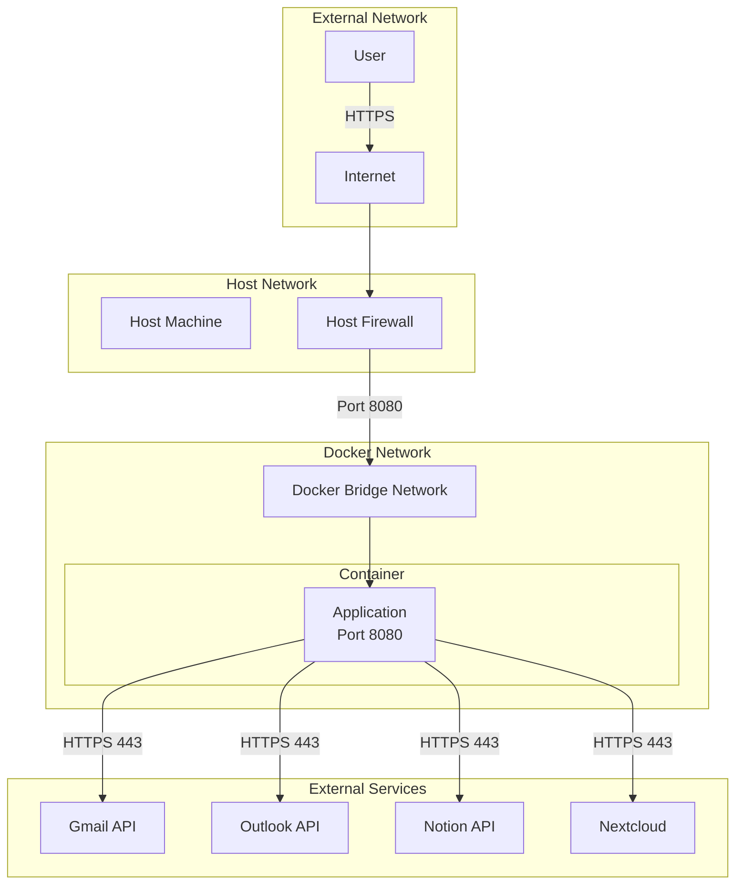

**Port Mapping**:
- `8080:8080` - Web UI and REST API (HTTP/WebSocket)
- **Note**: OAuth callbacks return to `http://localhost:8080/auth/{service}/callback`

**Network Security**:
- Container runs on bridge network (isolated)
- Only port 8080 exposed to host
- All external API calls over HTTPS
- OAuth callbacks handled on localhost (no external incoming connections)
- No incoming connections except port 8080

## Resource Management

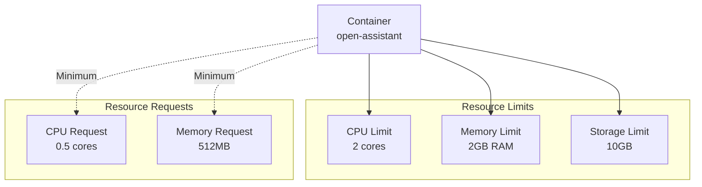

**Resource Configuration**:
```yaml
resources:
  limits:
    cpus: '2.0'
    memory: 2G
  reservations:
    cpus: '0.5'
    memory: 512M
```

## Deployment Models

### Development Deployment

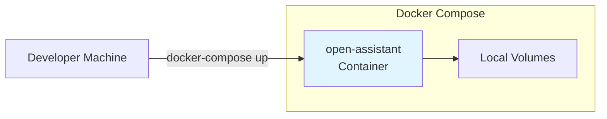

**Characteristics**:
- Single container on developer machine
- Local volume mounts for easy editing
- Hot reload enabled
- Debug logging enabled

### Production Deployment

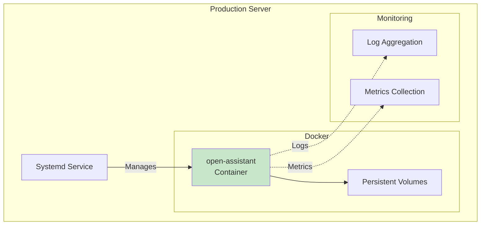

**Characteristics**:
- Managed by systemd
- Automatic restart on failure
- Production logging
- Backup automation
- Health checks

### Cloud Deployment (Future)

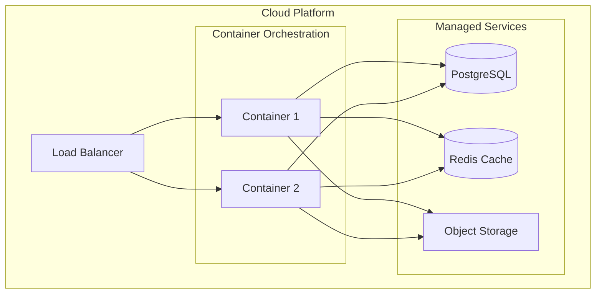

## Container Lifecycle

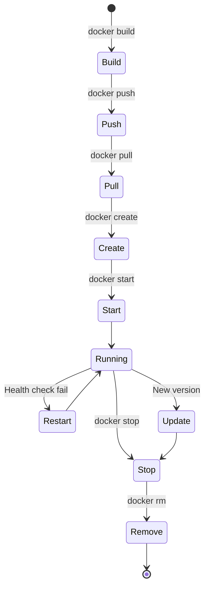

## Security Architecture

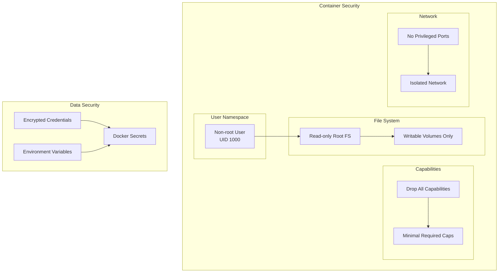

**Security Measures**:
1. **Container Isolation**
   - Runs as non-root user (UID 1000)
   - Read-only root filesystem
   - Dropped Linux capabilities
   - Isolated network namespace

2. **Data Protection**
   - Credentials encrypted with Fernet
   - Sensitive data in Docker secrets
   - Environment variables for config
   - Volume permissions restricted

3. **Network Security**
   - No privileged ports required
   - Outbound HTTPS only to APIs
   - Optional reverse proxy for SSL/TLS
   - Rate limiting on API endpoints

## Design Philosophy: Single-User, Self-Hosted

This application is **intentionally designed for single-user, self-hosted deployments**.

**Why Single Container**:
- Simplified deployment and maintenance
- Lower resource requirements
- Perfect for personal use cases
- No need for complex orchestration
- Easy backup and restore

**Not Included by Design**:
- ❌ High availability / clustering
- ❌ Load balancing
- ❌ Multi-tenancy
- ❌ Horizontal scaling

For organizational or multi-user deployments, consider forking and adapting the architecture.

## Backup and Recovery

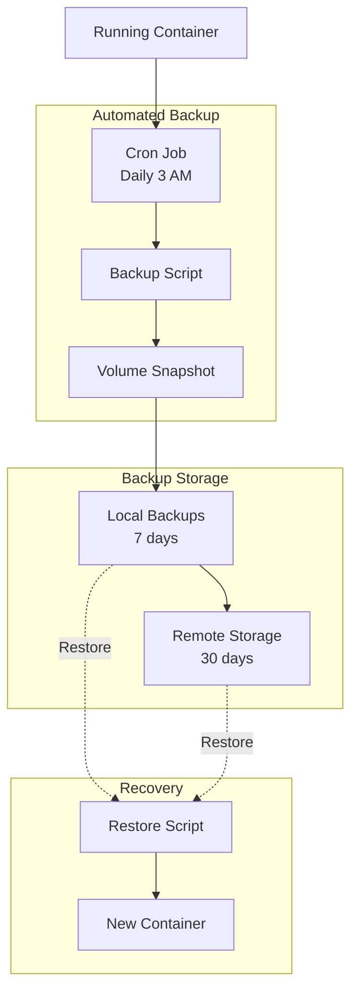

**Backup Strategy**:
- Automated daily backups via cron
- Volume snapshots (data, config)
- Local retention: 7 days
- Remote retention: 30 days
- One-command restore capability

## Monitoring and Health Checks

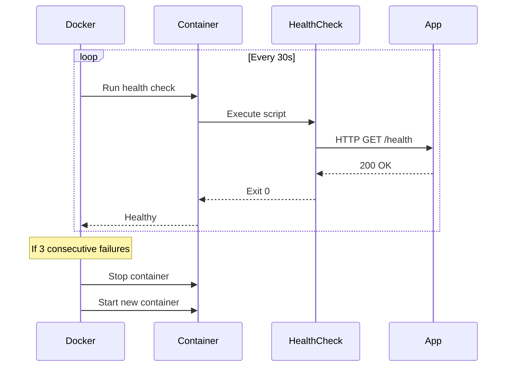

**Health Check Configuration**:
```dockerfile
HEALTHCHECK --interval=30s --timeout=10s --start-period=40s --retries=3 \
  CMD curl -f http://localhost:8080/health || exit 1
```

## Docker Compose Configuration

```yaml
version: '3.8'

services:
  open-assistant:
    image: open-assistant:latest
    container_name: open-assistant
    restart: unless-stopped

    ports:
      - "8080:8080"

    volumes:
      - ./data:/app/data
      - ./config:/app/config
      - ./logs:/app/logs

    environment:
      - ENVIRONMENT=production
      - LOG_LEVEL=INFO

    env_file:
      - .env

    deploy:
      resources:
        limits:
          cpus: '2.0'
          memory: 2G
        reservations:
          cpus: '0.5'
          memory: 512M

    healthcheck:
      test: ["CMD", "curl", "-f", "http://localhost:8080/health"]
      interval: 30s
      timeout: 10s
      retries: 3
      start_period: 40s

    security_opt:
      - no-new-privileges:true

    user: "1000:1000"

    read_only: true

    tmpfs:
      - /tmp:mode=1777,size=100M
```

## Systemd Integration

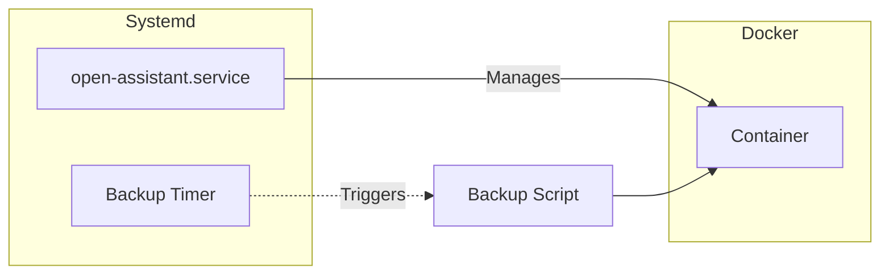

**Service File**: `/etc/systemd/system/open-assistant.service`

```ini
[Unit]
Description=Open Assistant
Requires=docker.service
After=docker.service

[Service]
Type=oneshot
RemainAfterExit=yes
WorkingDirectory=/opt/open-assistant
ExecStart=/usr/bin/docker-compose up -d
ExecStop=/usr/bin/docker-compose down
Restart=on-failure

[Install]
WantedBy=multi-user.target
```

## Update and Deployment Process

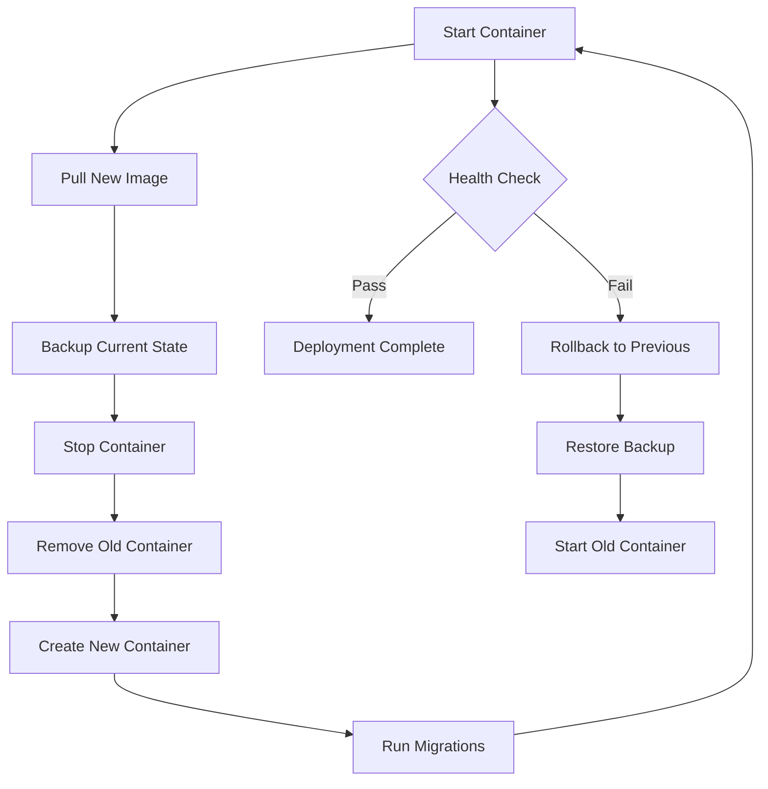

**Zero-Downtime Update** (with load balancer):
1. Start new container on different port
2. Run health checks
3. Switch load balancer to new container
4. Gracefully shutdown old container

## Logging Architecture

```mermaid
graph TB
    subgraph "Container"
        App[Application]
        Logs[/app/logs]
    end

    subgraph "Docker Logging"
        Driver[JSON-file Driver]
        Syslog[Syslog Driver]
    end

    subgraph "Log Management"
        Rotation[Log Rotation]
        Aggregation[Log Aggregation]
    end

    App --> Logs
    App --> Driver
    Driver --> Rotation
    Logs --> Aggregation

    Syslog --> Aggregation
```

**Log Configuration**:
- Application logs: `/app/logs/application.log`
- Docker stdout/stderr: JSON-file driver
- Log rotation: 10 files, 10MB each
- Optional: Syslog forwarding

## Environment Variables

**Required**:
```bash
DATABASE_URL=sqlite:///data/assistant.db
ENCRYPTION_KEY=<fernet-key>
```

**Optional**:
```bash
# Service Credentials
GMAIL_CREDENTIALS_PATH=/app/config/credentials/gmail_credentials.json
OUTLOOK_CLIENT_ID=<client-id>
OUTLOOK_CLIENT_SECRET=<client-secret>
NOTION_API_TOKEN=<token>

# Configuration
LOG_LEVEL=INFO
WEB_UI_PORT=8080
TIMEZONE=UTC
```

## Performance Tuning

**Database**:
- WAL mode enabled for SQLite
- Connection pooling
- Regular VACUUM operations

**Application**:
- Uvicorn workers: 2-4 (based on CPU cores)
- Async I/O for all API calls
- Request caching where applicable

**Container**:
- Memory limit: 2GB (adjust based on usage)
- CPU limit: 2 cores
- Disk I/O limits if needed

## Troubleshooting

### Container won't start
```bash
# Check logs
docker logs open-assistant

# Check volume permissions
ls -la /opt/open-assistant/data

# Check port conflicts
netstat -tulpn | grep 8080
```

### Performance issues
```bash
# Check resource usage
docker stats open-assistant

# Check disk space
df -h

# Check database size
du -sh /opt/open-assistant/data/
```

### Database locked
```bash
# Check for multiple processes
docker exec open-assistant ps aux

# Consider migration to PostgreSQL
```

## Related Documentation

- [Solution Architecture](solution-architecture.md) - Technology stack and frameworks
- [Software Architecture](software-architecture.md) - Application components and design
- [Database Schema](database-schema.md) - Database structure
- [Development Setup](../setup/development.md) - Local development environment